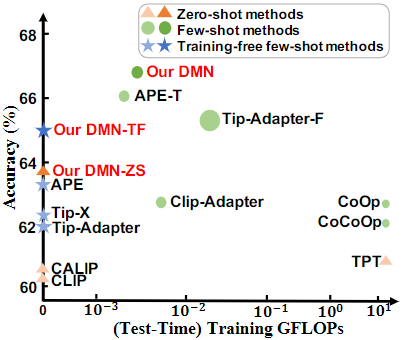
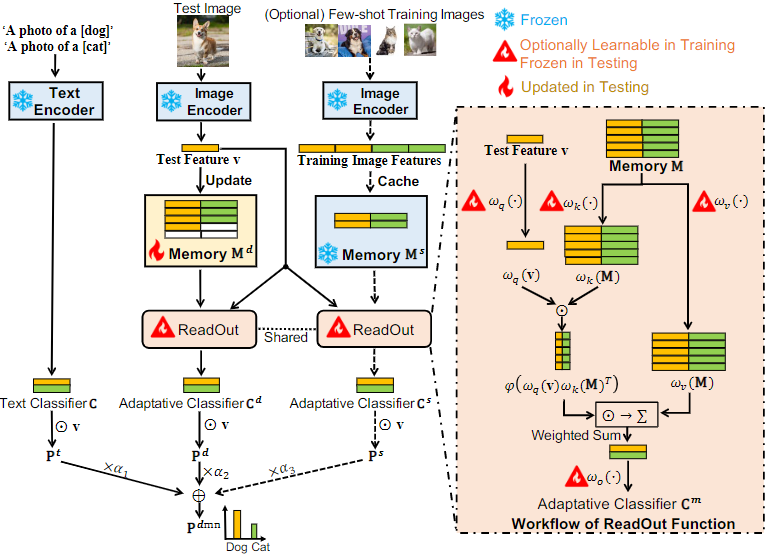
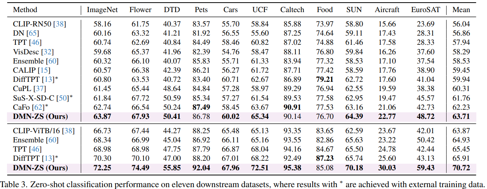
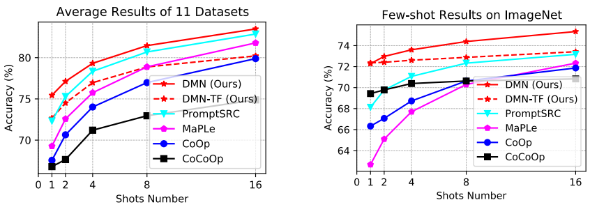

# Dual Memory Networks: A Versatile Adaptation Approach for Vision-Language Models

This repository provides the official PyTorch implementation of our CVPR 2024 paper:    

> [<ins>**Dual Memory Networks: A Versatile Adaptation Approach for Vision-Language Models**</ins>][Paper](https://arxiv.org/pdf/2403.17589)   
> Authors: *[<ins>**Yabin Zhang**</ins>](https://scholar.google.com/citations?user=p0GLwtoAAAAJ&hl=en), [<ins>**Wenjie Zhu**</ins>](https://scholar.google.com/citations?user=8hodVdAAAAAJ&hl=en&oi=sra), [<ins>**Hui Tang**</ins>](https://scholar.google.com/citations?user=eqVvhiQAAAAJ&hl=en), [<ins>**Zhiyuan Ma**</ins>](https://scholar.google.com/citations?user=F15mLDYAAAAJ&hl=en&oi=ao), [<ins>**Kaiyang Zhou**</ins>](https://scholar.google.com/citations?user=gRIejugAAAAJ&hl=en&oi=ao), [<ins>**Lei Zhang**</ins>](https://scholar.google.com/citations?user=tAK5l1IAAAAJ&hl=en&oi=ao)*   


## Overview
This repository contains the implementation of DMN for image classification with a pre-trained CLIP. We consider four task settings:  

* Zero-shot classification in a test-time adaptation manner
* Few-shot classification
* Training-free few-shot classification
* Out-of-distribution generalization

<p align = "center">

</p>
<p align = "center">
Results on ImageNet dataset under different task settings.
</p>

<p align = "center">

</p>
<p align = "center">
The overall framework of our DMN.
</p>

## Prerequisites

### Hardware

This implementation is for the single-GPU configuration. All experiments can be reproduced on a GPU with more than 10GB memory (e.g., 1080Ti)!

### Environment 
The code is tested on PyTorch 1.13.1.

### Datasets 

We suggest downloading all datasets to a root directory (`${data_root}`), and renaming the directory of each dataset as suggested in `${ID_to_DIRNAME}` in `./data/datautils.py`. This would allow you to evaluate multiple datasets within the same run.     
If this is not feasible, you could evaluate different datasets separately, and change the `${data_root}` accordingly in the bash script.


For zero/few-shot classification, we consider 11 datasets:
* [ImageNet](https://image-net.org/index.php) 
* [Flower102](https://www.robots.ox.ac.uk/~vgg/data/flowers/102/102flowers.tgz)
* [DTD](https://www.robots.ox.ac.uk/~vgg/data/dtd/download/dtd-r1.0.1.tar.gz)
* [OxfordPets](https://www.robots.ox.ac.uk/~vgg/data/pets/data/images.tar.gz)
* [StanfordCars](https://ai.stanford.edu/~jkrause/cars/car_dataset.html)
* [UCF101](https://drive.google.com/file/d/10Jqome3vtUA2keJkNanAiFpgbyC9Hc2O/view?usp=sharing)
* [Caltech101](http://www.vision.caltech.edu/Image_Datasets/Caltech101/101_ObjectCategories.tar.gz)
* [Food101](http://data.vision.ee.ethz.ch/cvl/food-101.tar.gz)
* [SUN397](http://vision.princeton.edu/projects/2010/SUN/SUN397.tar.gz)
* [Aircraft](https://www.robots.ox.ac.uk/~vgg/data/fgvc-aircraft/archives/fgvc-aircraft-2013b.tar.gz)
* [EuroSAT](http://madm.dfki.de/files/sentinel/EuroSAT.zip)
 
For out-of-distribution generalization, we consider 4 datasets:

* [ImageNet-A](https://github.com/hendrycks/natural-adv-examples)
* [ImageNet-R](https://github.com/hendrycks/imagenet-r)
* [ImageNet-V2](https://s3-us-west-2.amazonaws.com/imagenetv2public/imagenetv2-matched-frequency.tar.gz)
* [ImageNet-Sketch](https://github.com/HaohanWang/ImageNet-Sketch)

## Run DMN

We provide a simple bash script under `./scripts/run.sh`. You can modify the paths and other args in the script. One can easily reproduce all results by:    

```
bash ./scripts/run.sh
```
  
For simplicity, we use `set_id` to denote different datasets. A complete list of `set_id` can be found in `${ID_to_DIRNAME}` in `./data/datautils.py`. 


### Main Results

#### Zero-shot Classification
<p align = "center">

</p>
<p align = "center">
</p>

#### Few-shot Classification

<p align = "center">

</p>
<p align = "center">
Few-shot classification results on 11 datasets with a VITB/16 image encoder.
</p>

#### Out-of-Distribution Generalization

<div align="center">

| Method           | ImageNet(IN) | IN-A | IN-V2 | IN-R | IN-Sketch | Average | OOD Average |
|------------------|:--------:|:----------:|:-----------:|:----------:|:---------------:|:-------:|:-----------:|
| [CLIP-RN50](https://arxiv.org/abs/2103.00020)       |   58.16  |    21.83   |    51.41    |    56.15   |      33.37      |  44.18  |    40.69    |
| [Ensembled prompt](https://arxiv.org/abs/2103.00020)|   59.81  |    23.24   |    52.91    |    60.72   |      35.48      |  46.43  |    43.09    |
| [CoOp](https://arxiv.org/abs/2109.01134)            |   63.33  |    23.06   |    55.40    |    56.60   |      34.67      |  46.61  |    42.43    |
| [CoCoOp](https://arxiv.org/abs/2203.05557)          |   62.81  |    23.32   |    55.72    |    57.74   |      34.48      |  46.81  |    42.82    |
| [TPT](https://arxiv.org/pdf/2209.07511.pdf)             |   60.74  |    26.67   |     54.70    |    59.11   |      35.09      |  47.26  |    43.89    |
| DMN-ZS             |   **63.87**  |    **28.57**   |     **56.12**    |    **61.44**   |      **39.84**      |  **49.97**  |    **46.49**    |

</div>
<br />

## Citation
If you find our code useful or our work relevant, please consider citing: 
```
@inproceedings{zhang2024dual,
  title={Dual Memory Networks: A Versatile Adaptation Approach for Vision-Language Models},
  author={Zhang, Yabin and Zhu, Wenjie and Tang, Hui and Ma, Zhiyuan and Zhou, Kaiyang and Zhang, Lei},
  booktitle={Proceedings of the IEEE/CVF conference on computer vision and pattern recognition},
  year={2024}
}
```

## Acknowledgements
We thank the authors of [CoOp/CoCoOp](https://github.com/KaiyangZhou/CoOp) and [TPT](https://github.com/azshue/TPT/tree/main) for their open-source implementation and instructions on data preparation. 
